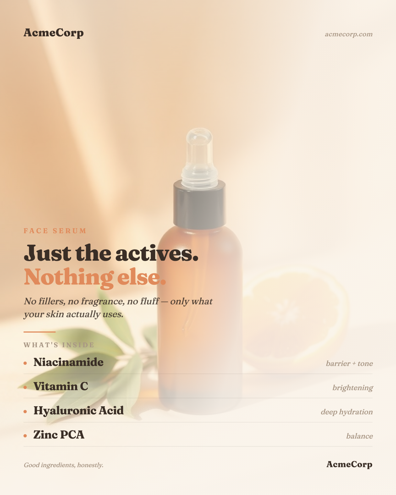
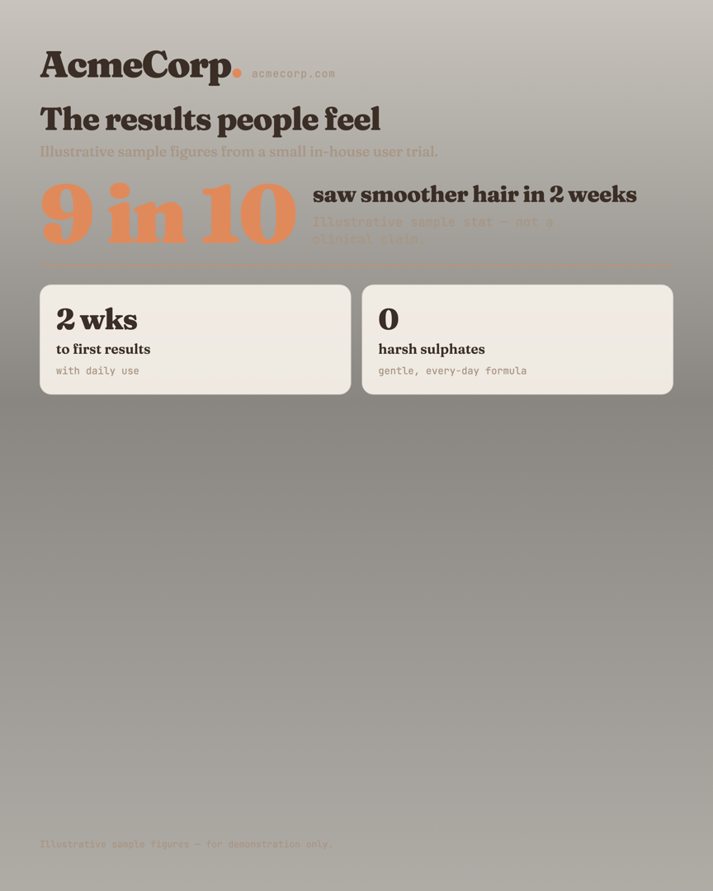

# Creative Generator

Turn a short brief into a finished, brand-consistent social image — generated by
**your coding agent itself**, looping through its own quality control until it's good.

No per-image LLM bill: your **coding agent is the brain** — Claude Code, Codex,
Antigravity, Cursor, or any agent that reads `AGENTS.md`. The only external service is a
**free** image model + critic (NVIDIA NIM).

## Examples
Real outputs for a demo brand. Left → right: a product + ingredients card, a stat-grid, and a hero shot.

<p>
  
  
  
</p>

```
brand (brands/<id>/: tokens + guidelines + examples)
   ->  Claude inspects them & drafts your brief in INPUTS.md
   ->  YOU review & confirm the brief        <- nothing runs before this
   ->  Claude routes it  ->  writes image prompt
   ->  NVIDIA Flux makes the picture  ->  Claude designs the layout
   ->  Chromium renders the card  ->  Claude looks at it & scores it
   ->  loops up to 3x  ->  output/ship.png
```

---

## Requirements

| # | Requirement | Why | Cost |
|---|---|---|---|
| 1 | **A coding agent** that reads `AGENTS.md` — Claude Code, Codex, Antigravity, Cursor, … | It's the brain — runs the whole pipeline in-context | Your existing agent subscription |
| 2 | **Python 3.10+** installed | Runs the helper scripts (image gen + render + critic) | Free |
| 3 | **A headless browser** via `playwright install chromium` | Renders the final card crisply (HTML → PNG) | Free, one-time ~90 MB download |
| 4 | **A free NVIDIA API key** — https://build.nvidia.com → sign in → "Get API Key" | Generates the background image (Flux) **and** runs the critic (Llama Vision) | Free within NVIDIA's quota |

> **No separate LLM API key for the brain.** The reasoning runs in your coding agent,
> covered by its subscription — there is no per-image LLM bill.
>
> **Heads-up:** this is not a zero-install tool. You need Python and the one-time browser
> install (step 2). Your agent can run those commands for you on first use.

## Setup — the agent onboards you
1. **Clone the repo** and open it in your coding agent (Claude Code / Codex / Antigravity / Cursor):
   ```
   git clone https://github.com/saahilr1/creative-generator.git
   cd creative-generator
   ```
2. **Run `bash setup.sh`** — quietly installs deps + the headless browser and creates `.env`
   (full logs in `setup.log`). Add your free NVIDIA key to `.env` when prompted.
3. **Say "onboard me."** The agent reads `AGENTS.md` and walks you through, one step at a time:
   sets up your brand (`brands/<you>/`) from your site/deck/example designs, and helps you write
   your first brief in `INPUTS.md`. *(Prefer manual? Copy `brands/_example/` → `brands/<you>/`,
   fill it, set `brand:` in `INPUTS.md`.)*
4. **Generate in a *fresh* session.** Onboard in one session; `/clear` and say "run it" to
   generate in the next. Keeping them separate is what keeps each session cheap (see token note).

> The repo ships the **engine + scaffold** only. Your brand folder (`brands/<you>/`) and
> your `.env` are yours — they're gitignored and never committed.

## Use it (every time)

**Two ways to give Claude your brief:**

**A) Let Claude draft it from examples (recommended)**
1. Put a few designs the brand likes in **`brands/<brand_id>/examples/`** (PNG/JPG).
2. Tell Claude: **"draft my brief."** Claude inspects the brand's examples + guidelines and
   fills **`INPUTS.md`** for you.

**B) Fill it yourself**
1. Open **`INPUTS.md`**, set **`brand:`** to your brand, and fill the required fields.

> **Brand setup (once per brand):** each brand is a folder under **`brands/<brand_id>/`**
> (`brand.yaml` tokens + `GUIDELINES.md` voice/visual + `examples/`). Copy `brands/_example/`
> to start, or use the onboarding prompt in **`brands/ONBOARDING.md`**. Pick the active brand
> via `brand:` in `INPUTS.md`.

**Then, either way:**
2. Confirm `brand:` in `INPUTS.md` points to the right brand folder.
3. **Review `INPUTS.md`** — your agent always pauses for your OK before generating anything.
   Edit it, then say **"looks good, run it."**
4. The agent generates the image, shows each step + the critic's verdict, and saves the
   final to **`output/ship.png`** (with `output/ship.meta.md` for full provenance).

Want changes? Just say "make the headline bigger / try the split layout / warmer
colours" and Claude reruns.

### Theme & output modes
- **`theme`** (in `INPUTS.md`) anchors each run's topic for both image and copy.
- **`output_type`** picks what you get:
  - `single` (default) → one `ship.png`.
  - `variations` → 2–4 options of the same brief to choose from (`ship_v1..N.png`).
  - `carousel` → one brief → a consistent multi-slide set (`ship_slide1..N.png`),
    hook → points → CTA, tied together by the theme.

## What's in here
| File / folder | What it is |
|---|---|
| `INPUTS.md` | Your brief — edited each time (by you, or drafted by Claude); sets the active `brand:` |
| `brands/<brand_id>/` | One folder per brand: `brand.yaml` tokens + `GUIDELINES.md` + `examples/`. `_example/` is the template; `ONBOARDING.md` adds new brands |
| `AGENTS.md` | The pipeline instructions your agent follows — single source of truth (don't edit unless customising). `CLAUDE.md` / `GEMINI.md` are thin pointers to it |
| `recipes/` | Parameterized layout recipes the agent fills (`INDEX.md` = catalog + selection heuristics). The token-lean core |
| `scripts/` | Mechanical helpers: `gen_raster` (Flux), `render` (HTML→PNG), `critique` + `critique_bg` (vision critic), `compare_eval` |
| `eval/` | Your scoring workspace: a CSV template + README (calibrate the critic) |
| `output/` | `output/<date>/` = finished assets; `output/_archive/<date>/` = intermediates |

## Output format
- The final asset is a **PNG** (`output/ship.png`) at your chosen size
  (e.g. 4:5 = 1080×1350), plus `output/ship.meta.md` with the full provenance.
- **PNG only — no SVG.** The background image is AI-generated and is therefore a
  bitmap (it can't be true vector), so an SVG export would add little for now.
  Editable-vector output may come later if there's a real need.

## Cost
- The brain's reasoning: covered by your coding-agent subscription (Claude Code / Codex / Antigravity / …).
- Image generation + critic: free within NVIDIA's quota.

## Keep it token-cheap (session hygiene)
The brain runs in your coding agent, so the real cost is **how much context each turn carries** —
and the biggest lever isn't the design, it's the session.
- **One asset per fresh session.** `/clear` (or start a new session) between assets. A long
  multi-asset session re-reads its entire history every turn — that's what makes tokens balloon,
  not the artwork. File-based state survives a reset; just reopen the folder.
- **`mode: routine`** (fill a recipe) is the cheap path (~8–10K tokens/asset in a fresh session).
  **`mode: hero`** (bespoke Flux-as-content) costs ~2–3× — reserve it for flagship posts.
- Keep redo loops low; vet the brief at the review gate before generating.
